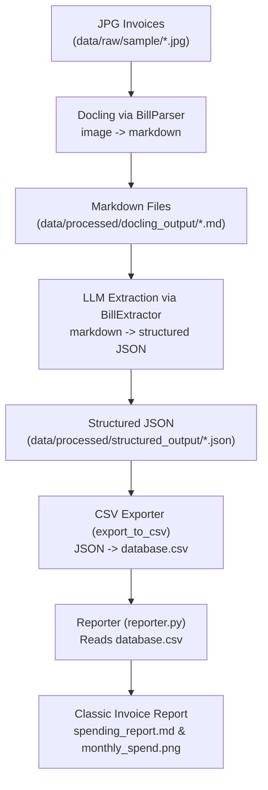

## Bill Parser Pipeline Flow

```mermaid
flowchart TB
    A["JPG Invoices<br/>(data/raw/sample/*.jpg)"] --> B["Docling via BillParser<br/>image -> markdown"]
    B --> C["Markdown Files<br/>(data/processed/docling_output/*.md)"]
    C --> D["LLM Extraction via BillExtractor<br/>markdown -> structured JSON"]
    D --> E["Structured JSON<br/>(data/processed/structured_output/*.json)"]
    E --> F["CSV Exporter (export_to_csv)<br/>JSON -> database.csv"]
    F --> G["Reporter (reporter.py)<br/>Reads database.csv"]
    G --> H["Classic Invoice Report<br/>spending_report.md & monthly_spend.png"]
```