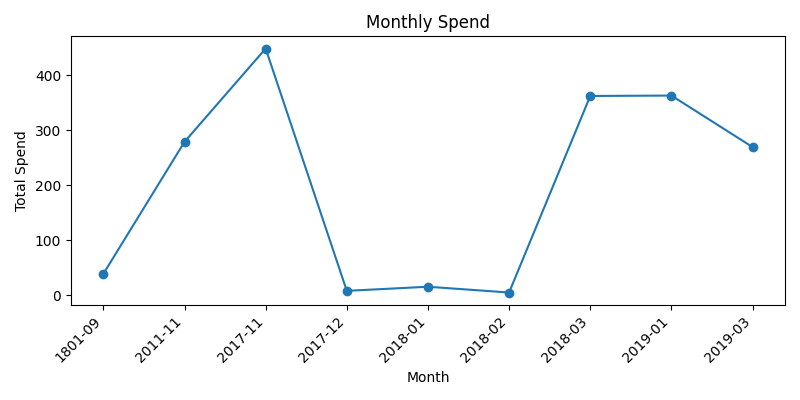

# Spending Report

## Overview

- **Period**: 1801-09-21 to 2019-03-03
- **Total spend**: 1789.11
- **Average monthly spend**: 198.79
- All amounts below are shown in **MYR**. Original data contained multiple currencies ['MYR', 'RM', 'USD', 'ZRL']; for this MVP, only the most common currency (MYR) is shown.

## Monthly Trend

- **Highest month**: 2017-11 with 448.50
- **Lowest month**: 2018-02 with 4.90

## Top Vendors

- **LIGHTROOM GALLERY SDN BHD**: 557.60
- **OJC MARKETING SDN BHD**: 363.00
- **Grand Companions Sdn Bhd**: 269.40
- **99 SPEED MART S/B**: 169.70
- **BENS INDEPENDENT GROCER SDN. BHD**: 133.70

## Biggest Invoices

- **LCN00212**, from LIGHTROOM GALLERY SDN BHD, on 2017-11-20, amount: 278.80
- **LCN00212**, from LIGHTROOM GALLERY SDN BHD, on 2011-11-20, amount: 278.80
- **65991**, from Grand Companions Sdn Bhd, on 2019-03-03, amount: 269.40
- **PEGIV-1030765**, from OJC MARKETING SDN BHD, on 2019-01-15, amount: 193.00
- **PEGIV-1030531**, from OJC MARKETING SDN BHD, on 2019-01-02, amount: 170.00
